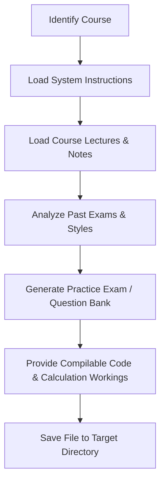

# 🎓 Exam Creation & Study Guide Workspace

Welcome to the **Exam-Creation** workspace. This repository is structured to manage lecture content, sections, previous exams, and generated guide answers/question banks for university courses. It serves as an automated hub for creating study aids, aligning closely with course material and previous exams.

---

## 📚 Supported Courses Overview

The workspace currently supports the following courses:

| Course Name | Folder Path | Dedicated System Prompt / Instructions | Key Focus Areas |
| :--- | :--- | :--- | :--- |
| **Cybersecurity (CyberSec)** | [CyberSec/]( /CyberSec) | [Cyberinstructions.md]( /CyberSec/Cyberinstructions.md) | Cryptography (Symmetric/Asymmetric), network protocol security, malware analysis, PKI, and threat mitigation. |
| **Advanced Programming Applications (AdvancedPro)** | [AdvancedPro/]( /AdvancedPro) | [APA-insturction.md]( /AdvancedPro/APA-insturction.md) | Java backend engineering, Spring Boot architectures, JPA mappings, Thymeleaf templating, and multithreading concurrency. |
| **Computer Organization & Architecture (COA)** | [ComputerArch/]( /ComputerArch) | [COA-instuction.md]( /ComputerArch/COA-instuction.md) | MARIE CPU architecture, RTL micro-operations, control gate design, pipeline speedups, cache mappings, and virtual memory. |

---

## 📂 Materials & Resources by Course

### 🛡️ 1. Cybersecurity (CyberSec)

This module covers network endpoint security, cryptography, malware, and key management.

| Category | File Link | Description |
| :--- | :--- | :--- |
| **Lectures** | [CyberMalware.txt]( /CyberSec/Lec/CyberMalware.txt) | Types of malware, propagation mechanisms, and defense. |
| | [Hashfunction.txt]( /CyberSec/Lec/Hashfunction.txt) | Cryptographic hash functions, properties (one-way, collision resistance), and SHA. |
| | [ModernCy[her]( /CyberSec/Lec/ModernCy%5Bher) | Modern symmetric and asymmetric cryptography. |
| | [NetEndPointSec]( /CyberSec/Lec/NetEndPointSec) | Network security, firewalls, and endpoint defense. |
| | [NetworkSecurityBasics.txt]( /CyberSec/Lec/NetworkSecurityBasics.txt) | Fundamental security goals (CIA triad) and network attacks. |
| | [cyberAttack]( /CyberSec/Lec/cyberAttack) | Categories and details of cyber attacks. |
| | [keymang]( /CyberSec/Lec/keymang) | Key distribution, KDC, KTC, and symmetric key management. |
| | [publicKey]( /CyberSec/Lec/publicKey) | Public-key infrastructure (PKI), RSA, and X.509 certificates. |
| **Previous Exams** | [23]( /CyberSec/PrevExam/23) | Past exam script from 2023. |
| | [25.txt]( /CyberSec/PrevExam/25.txt) | Past exam script from 2025. |
| | [midterm_A.pdf]( /CyberSec/PrevExam/midterm_A.pdf) | Midterm exam model A. |
| | [midterm_makeup.pdf]( /CyberSec/PrevExam/midterm_makeup.pdf) | Midterm makeup exam model. |
| **Guide Answers** | [Exam_23_Guide_Answers.md]( /CyberSec/GuideAnswer/Exam_23_Guide_Answers.md) | Step-by-step model solutions for the 2023 exam. |
| | [Exam_25_Guide_Answers.md]( /CyberSec/GuideAnswer/Exam_25_Guide_Answers.md) | Step-by-step model solutions for the 2025 exam. |
| | [KeyManagement_Summary_And_Questions.md]( /CyberSec/GuideAnswer/KeyManagement_Summary_And_Questions.md) | Detailed question bank focusing on key management. |
| | [NetEndPointSec_QuestionBank.md]( /CyberSec/GuideAnswer/NetEndPointSec_QuestionBank.md) | Detailed question bank focusing on firewalls and endpoint security. |
| | [NetworkBasics_HashFunction_QuestionBank.md]( /CyberSec/GuideAnswer/NetworkBasics_HashFunction_QuestionBank.md) | Detailed question bank focusing on hash functions and security basics. |

---

### 💻 2. Advanced Programming Applications (AdvancedPro)

This module focuses on modern Java backend development, Spring Boot, JPA/Hibernate, and Multithreading.

| Category | File Link | Description |
| :--- | :--- | :--- |
| **Lectures** | [Lect1-JDBC]( /AdvancedPro/Lect/Lect1-JDBC) | Java Database Connectivity API core steps and statements. |
| | [Lec3-HTTPServlet]( /AdvancedPro/Lect/Lec3-HTTPServlet) | HttpServlets, RequestDispatchers, redirects, and stateful Cookies. |
| | [Lec5-MVC-Thymleaf]( /AdvancedPro/Lect/Lec5-MVC-Thymleaf) | Model-View-Controller pattern basics and Thymeleaf templates. |
| | [Lect6-Spring_Boot_Architecture.md]( /AdvancedPro/Lect/Lect6-Spring_Boot_Architecture.md) | Spring Boot layered architecture and application flow. |
| | [Lect7-IOC_DI_SpringBoot2.md]( /AdvancedPro/Lect/Lect7-IOC_DI_SpringBoot2.md) | Inversion of Control (IoC), Dependency Injection (DI), and bean definitions. |
| | [Lect9-Session_Req_Singleton_Proxy_Vs_Bean_SpringBoot3.md]( /AdvancedPro/Lect/Lect9-Session_Req_Singleton_Proxy_Vs_Bean_SpringBoot3.md) | Scopes (Request, Session, Singleton), Proxying, and injection conflicts. |
| | [Lect10_Hibernate_ORM_Vs_JPA_Thymleaf_SpringBoot.md]( /AdvancedPro/Lect/Lect10_Hibernate_ORM_Vs_JPA_Thymleaf_SpringBoot.md) | JPA entities, relationship mappings, `JpaRepository`, and Thymeleaf form binding. |
| | [Lect11_Scheduler_sleep_yield_join_Priority_MultiThreading1.md]( /AdvancedPro/Lect/Lect11_Scheduler_sleep_yield_join_Priority_MultiThreading1.md) | Thread creation, runnable execution, priority scheduling, and thread control. |
| | [Lect12 ThreadPool(Exuotor ,RaceCondition, Sync)-MultiThreading part 2]( /AdvancedPro/Lect/Lect12%20ThreadPool(Exuotor%20,RaceCondition,%20Sync)-MultiThreading%20part%202) | Concurrency thread pools, race conditions, critical regions, and synchronization. |
| **Previous Exams** | [25.md]( /AdvancedPro/PrevExams/25.md) | Past exam rewritten to Spring Boot, JPA, and Thymeleaf technologies. |
| | [25-26.md]( /AdvancedPro/PrevExams/25-26.md) | Historical exam script rewritten to replace raw Servlets/JSP with modern Spring Boot. |
| **Question Banks** | [Lect9_Scopes_questions.md]( /AdvancedPro/AI-QestionBank/Lect9_Scopes_questions.md) | Practice questions on Spring Bean scopes, Sessions, and Dynamic Proxies. |
| | [Lect10_JPA_questions.md]( /AdvancedPro/AI-QestionBank/Lect10_JPA_questions.md) | Practice questions on ORM, entity mappings, relationships, and Thymeleaf form binding. |
| | [Lect11_Multithreading1_questions.md]( /AdvancedPro/AI-QestionBank/Lect11_Multithreading1_questions.md) | Practice questions on thread memory models, execution states, and basic coordination. |
| | [Lect12_ThreadPool_Synchronization_questions.md]( /AdvancedPro/AI-QestionBank/Lect12_ThreadPool_Synchronization_questions.md) | Practice questions on fixed thread pools, critical regions, race conditions, and locking. |

---

### 💻 3. Computer Organization & Architecture (COA)

This module focuses on CPU datapath design, MARIE assembly, instruction execution sequencing, memory hierarchy, cache mapping calculations, and paging translation.

| Category | File Link | Description |
| :--- | :--- | :--- |
| **Lectures** | [Revision.txt]( /ComputerArch/Lec/Revision.txt) | Comprehensive core content covering MARIE architecture through virtual memory. |
| **Sections** | [8.1-Section.txt]( /ComputerArch/Section/8.1-Section.txt) | Practice problems and conceptual questions focusing on cache mapping. |
| | [8.2-Section.txt]( /ComputerArch/Section/8.2-Section.txt) | Practice problems and conceptual questions focusing on virtual memory paging. |
| **Previous Exams** | [25.txt]( /ComputerArch/PrevExams/25.txt) | Exam paper covering standard introductory COA conceptual and mapping questions. |
| | [26.txt]( /ComputerArch/PrevExams/26.txt) | Design-heavy exam paper covering RTL tracing, control gates, and hardware chips. |
| **Question Banks** | [Exam_1_Standard.md]( /ComputerArch/Ai-qestion-bank/Exam_1_Standard.md) | Practice exam covering standard introductory MCQ, True/False, and calculations. |
| | [Exam_2_Advanced_Design.md]( /ComputerArch/Ai-qestion-bank/Exam_2_Advanced_Design.md) | Design-heavy practice exam focusing on RTL, gate level wiring, status flags, and chips. |
| | [Exam_3_Calculations_Control.md]( /ComputerArch/Ai-qestion-bank/Exam_3_Calculations_Control.md) | Practice exam focusing on expanding opcodes, multi-level cache EAT, and page mapping. |
| | [Exam_4_Comprehensive_Coverage.md]( /ComputerArch/Ai-qestion-bank/Exam_4_Comprehensive_Coverage.md) | Practice exam covering comparisons, postfix stack traces, custom RTL, and RAM systems. |

---

## 🛠️ AI Generation & Automation Workflow

To leverage an AI agent or LLM for generating new question banks or grading solutions within this workspace:

### Process Steps:
1. **Load Instructions:** Provide the dedicated system prompt (e.g., [COA-instuction.md]( /ComputerArch/COA-instuction.md)).
2. **Context Intake:** Feed the active lectures, section worksheets, and historical exams.
3. **Calibrated Generation:** Ensure all guide answers show complete step-by-step math calculations, exact code snippets, or proper RTL sequences.
4. **Target Save:** Save generated outputs in the respective folder (e.g., [Ai-qestion-bank/]( /ComputerArch/Ai-qestion-bank)).
