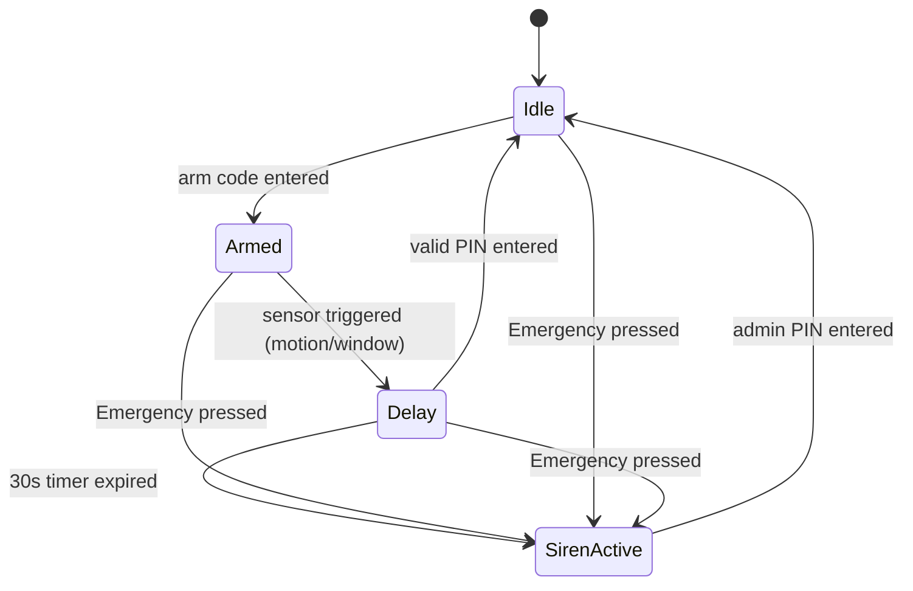

# CSE2001 - Software Engineering
## Simulated Exam 3: Guide Answer & Marking Scheme

---

### Section A: Complete the Statements (10 Marks, 2 Marks Each)

1. **time**  
   *(Ref: [AllContent.txt:1042-1043](file:///d:/Gam3a/Exam-Creation/SoftwareEng/Lec/AllContent.txt#L1042-1043) - "...depends on the results produced and the time at which those results are produced.")*
2. **soft**  
   *(Ref: [AllContent.txt:1045-1048](file:///d:/Gam3a/Exam-Creation/SoftwareEng/Lec/AllContent.txt#L1045-1048) - "Soft real-time: Operation is degraded if results are not produced according to timing...")*
3. **periodic**  
   *(Ref: [AllContent.txt:1057-1058](file:///d:/Gam3a/Exam-Creation/SoftwareEng/Lec/AllContent.txt#L1057-1058) - "Periodic stimuli: Occur at predictable time intervals.")*
4. **sensor control**  
   *(Ref: [AllContent.txt:1076](file:///d:/Gam3a/Exam-Creation/SoftwareEng/Lec/AllContent.txt#L1076) - "Sensor control processes: Collect information from sensors and may buffer it.")*
5. **timing analysis**  
   *(Ref: [AllContent.txt:1089](file:///d:/Gam3a/Exam-Creation/SoftwareEng/Lec/AllContent.txt#L1089) - "Timing analysis: Analyze timing constraints and deadlines.")*

---

### Section B: Short Answer & Explanations (15 Marks, 5 Marks Each)

#### 1. Why sequential programming loops are insufficient & the process-based architecture (5 Marks)
*Award 2.5 marks for explaining the sequential loop weakness, and 2.5 marks for the process-based architecture. (Ref: [AllContent.txt:1073-1082](file:///d:/Gam3a/Exam-Creation/SoftwareEng/Lec/AllContent.txt#L1073-1082))*
* **Sequential Loop Weakness:** In a sequential loop, inputs are checked one by one. If one input takes a long time to process, it delays checking subsequent inputs. Since different stimuli have different timing constraints and deadlines, high-priority stimuli may miss their deadlines because the CPU is stuck executing a low-priority task.
* **Process-based Architecture:** Instead of a single loop, the system is designed as cooperating processes running concurrently under the control of a real-time executive (scheduler). This allows critical tasks (e.g., sensor control) to run at high priority and interrupt lower-priority tasks (e.g., data processing) to ensure timing deadlines are guaranteed.

#### 2. Five characteristics of embedded real-time systems (5 Marks)
*Award 1 mark for each valid characteristic listed. (Ref: [AllContent.txt:1051](file:///d:/Gam3a/Exam-Creation/SoftwareEng/Lec/AllContent.txt#L1051))*
1. They run continuously and do not terminate.
2. Interactions with the environment are unpredictable.
3. They must operate under physical limitations (e.g., memory, power, size).
4. They require direct hardware interactions (sensors, actuators).
5. Safety and reliability dominate the design choices.

#### 3. Functional vs Domain Requirements & Train braking system example (5 Marks)
*Award 2 marks for functional vs domain explanation, and 3 marks for the train braking system domain example. (Ref: [AllContent.txt:445-458](file:///d:/Gam3a/Exam-Creation/SoftwareEng/Lec/AllContent.txt#L445-458))*
* **Difference:** Functional requirements specify what services the software must provide and how it reacts to inputs. Domain requirements are constraints derived directly from the application domain (e.g., physics, banking laws) rather than specific user requests.
* **Domain Example:** For a train braking system, a domain requirement would specify: *"The train braking deceleration rate must be calculated based on the track gradient, speed, and current track adhesion conditions as governed by physical railway braking laws."* (This represents a constraint imposed by the physics of railway operation).

---

### Section C: Differences and Comparisons (10 Marks, 5 Marks Each)

#### 1. Periodic vs Aperiodic Stimuli (5 Marks)
*Award up to 5 marks based on the comparison points. (Ref: [AllContent.txt:1057-1066](file:///d:/Gam3a/Exam-Creation/SoftwareEng/Lec/AllContent.txt#L1057-1066))*

| Point of Comparison | Periodic Stimuli | Aperiodic Stimuli |
| :--- | :--- | :--- |
| **Predictability of arrival** | Occurs at predictable, regular time intervals. | Occurs irregularly and unpredictably. |
| **Typical trigger mechanism** | Polling controlled by a system timer. | Interrupts triggered by external physical events. |
| **Concrete Example** | Polling a temperature sensor every 50ms. | An emergency manual override button press or power failure interrupt. |

#### 2. Hard Real-Time vs Soft Real-Time (5 Marks)
*Award up to 5 marks based on completeness. (Ref: [AllContent.txt:1044-1050](file:///d:/Gam3a/Exam-Creation/SoftwareEng/Lec/AllContent.txt#L1044-1050))*

| Point of Comparison | Hard Real-Time | Soft Real-Time |
| :--- | :--- | :--- |
| **Definition of correctness** | Depends on producing correct logical results AND meeting timing deadlines. | Depends on logical results, but deadlines are flexible. |
| **Consequence of missing deadline** | Total system failure, potentially catastrophic (safety hazard, physical damage). | Degraded performance or reduced quality of service, but system survives. |
| **Practical Example** | Anti-lock braking system (ABS); Pacemaker controller. | Video streaming player; Online gaming system. |

---

### Section D: Case Study and Scenario-Based Modeling (15 Marks)

#### 1. State Machine Modeling (7 Marks)
*Award 1 mark for each correct state represented, and 3 marks for correct transitions/triggers. (Ref: [AllContent.txt:1105-1107](file:///d:/Gam3a/Exam-Creation/SoftwareEng/Lec/AllContent.txt#L1105-1107))*

#### 2. Real-time Classification (4 Marks)
*Award 2 marks for classification, and 2 marks for the justification. (Ref: [AllContent.txt:1044-1050](file:///d:/Gam3a/Exam-Creation/SoftwareEng/Lec/AllContent.txt#L1044-1050))*
* **Classification:** **Soft Real-Time System**.
* **Justification:** Missing the timing deadline (e.g., sounding the siren at 31 seconds instead of exactly 30 seconds, or a minor delay in registering a button press) degrades the performance and quality of the alarm system, but it does not lead to an immediate catastrophic failure of the software system, physical injury, or loss of life due to the system crash itself.

#### 3. Stimuli Identification (4 Marks)
*Award 2 marks for periodic stimulus, and 2 marks for aperiodic stimulus. (Ref: [AllContent.txt:1057-1066](file:///d:/Gam3a/Exam-Creation/SoftwareEng/Lec/AllContent.txt#L1057-1066))*
* **Periodic Stimulus:** The regular polling of the motion sensors and window contact sensors (e.g., checking status every 100ms) to monitor if they have been tripped.
* **Aperiodic Stimulus:** The keypad input events (e.g., entering the arming code, valid PIN, admin PIN, or pressing the Emergency panic button) which happen at unpredictable times and generate hardware interrupts.
