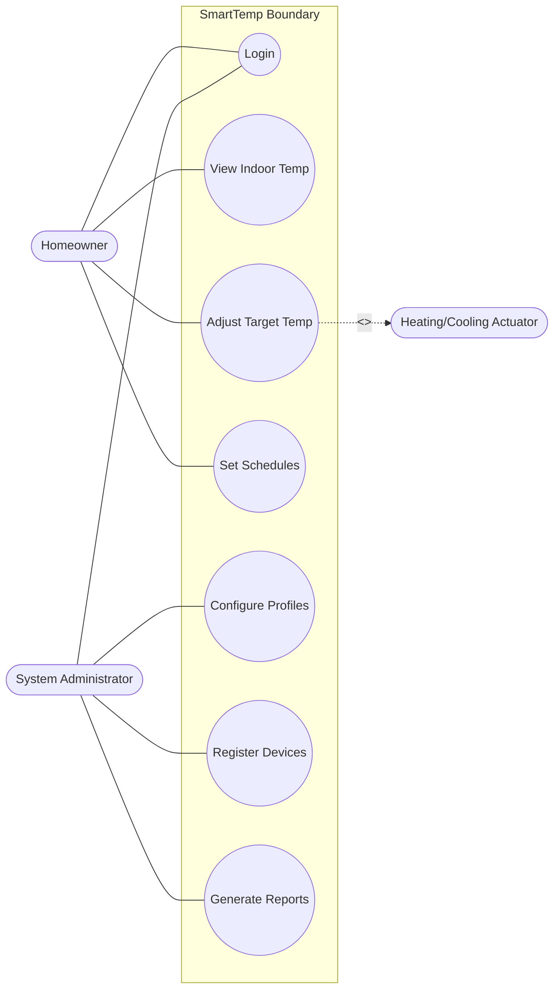
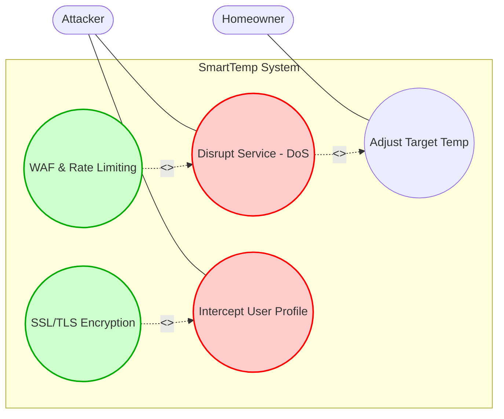
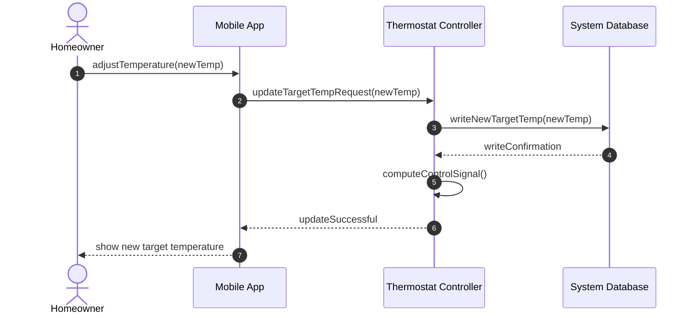

# CSE2001 - Software Engineering
## Simulated Exam 4: Guide Answer & Marking Scheme

---

### Section A: Complete the Statements (10 Marks, 2 Marks Each)

1. **Defined**  
   *(Ref: [AllContent.txt:295](file:///d:/Gam3a/Exam-Creation/SoftwareEng/Lec/AllContent.txt#L295) - "Defined: Process management procedures and strategies defined and used.")*
2. **system as a whole**  
   *(Ref: [AllContent.txt:512-513](file:///d:/Gam3a/Exam-Creation/SoftwareEng/Lec/AllContent.txt#L512-513) - "Non-functional requirements... often apply to the system as a whole.")*
3. **acceptance**  
   *(Ref: [AllContent.txt:776](file:///d:/Gam3a/Exam-Creation/SoftwareEng/Lec/AllContent.txt#L776) - "Acceptance testing: Customers test whether the system is ready to be accepted and deployed...")*
4. **vulnerability**  
   *(Ref: [AllContent.txt:919](file:///d:/Gam3a/Exam-Creation/SoftwareEng/Lec/AllContent.txt#L919) - "Vulnerability: Weakness that may be exploited.")*
5. **data processor**  
   *(Ref: [AllContent.txt:1077-1079](file:///d:/Gam3a/Exam-Creation/SoftwareEng/Lec/AllContent.txt#L1077-1079) - "Data processor: Processes collected information and computes response.")*

---

### Section B: Short Answer & Explanations (15 Marks, 5 Marks Each)

#### 1. Spiral Model vs V-Model Comparison (5 Marks)
*Award 1.5 marks for Risk Management comparison, 1.5 marks for Changing Requirements comparison, and 2 marks for Test Planning comparison. (Ref: [AllContent.txt:303-328](file:///d:/Gam3a/Exam-Creation/SoftwareEng/Lec/AllContent.txt#L303-328))*
* **Risk Management:** The Spiral model is explicitly risk-driven, dedicating a specific phase in each loop to identify and analyze risks. The V-model is plan-driven and does not have an explicit risk-analysis activity.
* **Changing Requirements:** The Spiral model is highly flexible, allowing requirements to be refined and re-evaluated at each loop/iteration. The V-model is inflexible, as requirements are frozen at the beginning, making subsequent changes costly.
* **Test Planning:** The V-model emphasizes testing early, directly linking development stages (e.g., requirements, design) to corresponding testing phases (e.g., acceptance testing, system testing planning). In the Spiral model, validation happens within each cycle but lacks the sequential mapping of the V-model.

#### 2. Final Requirements Compromise and Change Management Process (5 Marks)
*Award 2 marks for explaining why requirements are a compromise, and 3 marks for detailing the three change management steps. (Ref: [AllContent.txt:462-468](file:///d:/Gam3a/Exam-Creation/SoftwareEng/Lec/AllContent.txt#L462-468) & [L489-506](file:///d:/Gam3a/Exam-Creation/SoftwareEng/Lec/AllContent.txt#L489-506))*
* **Why Compromise:** Large systems have diverse user communities with different, sometimes conflicting priorities. Final requirements are a compromise to balance these conflicting needs.
* **Three-Step Change Management Process:**
  1. **Problem analysis and change specification:** The proposed change is analyzed to check if it is valid.
  2. **Change analysis and costing:** The impact and cost of the change are assessed using requirements traceability links and design knowledge to decide whether to accept the change.
  3. **Change implementation:** The requirements document and, if necessary, system design and code are modified to apply the accepted change.

#### 3. Security as a Dependability Prerequisite (5 Marks)
*Award 1.25 marks for each of the four properties explained. (Ref: [AllContent.txt:965-975](file:///d:/Gam3a/Exam-Creation/SoftwareEng/Lec/AllContent.txt#L965-975))*
* **Reliability:** Attacks can corrupt critical system code or data records, causing software execution failures and crashes.
* **Availability:** Cyberattacks like Denial-of-Service (DoS) deliberately overload servers, rendering services unavailable to legitimate users.
* **Safety:** In safety-critical systems, a security breach could override safety parameters, leading to accidents and physical hazards.
* **Resilience:** Security compromises can target backup servers or recovery mechanisms, preventing the system from resisting and recovering from failures.

---

### Section C: Differences and Comparisons (10 Marks, 5 Marks Each)

#### 1. Validation Testing vs Defect Testing (5 Marks)
*Award 2.5 marks for objective comparison, and 2.5 marks for successful test comparison. (Ref: [AllContent.txt:602-617](file:///d:/Gam3a/Exam-Creation/SoftwareEng/Lec/AllContent.txt#L602-617))*

| Point of Comparison | Validation Testing | Defect Testing |
| :--- | :--- | :--- |
| **Primary Objective** | Show that the system conforms to its specification and meets customer requirements. | Expose bugs and find situations where system behavior is incorrect. |
| **Successful Test Signifies** | The system operates correctly as intended under the given test case. | The test succeeded in breaking the system, revealing a defect. |

#### 2. Levels of Security Engineering (5 Marks)
*Award 1.5 marks for each level's description, and 0.5 marks for identifying the software engineering level. (Ref: [AllContent.txt:884-888](file:///d:/Gam3a/Exam-Creation/SoftwareEng/Lec/AllContent.txt#L884-888))*
* **Infrastructure security:** Protects shared networks and system infrastructure services.
* **Application security:** Protects individual application systems. **This is a software engineering responsibility.**
* **Operational security:** Protects secure operation and human behavior in the use of systems.

---

### Section D: Case Study and Scenario-Based Modeling (15 Marks)

#### 1. Use Case Diagram (5 Marks)
*Award marks for actors (2 Marks) and correct associations (3 Marks).*

#### 2. Misuse Case Diagram (5 Marks)
*Award marks for attacker (1 Mark), threat use cases (2 Marks), and mitigation links (2 Marks). (Ref: [AllContent.txt:920-944](file:///d:/Gam3a/Exam-Creation/SoftwareEng/Lec/AllContent.txt#L920-944))*

#### 3. Sequence Diagram (5 Marks)
*Award marks for participants (2 Marks) and sequential message flow (3 Marks).*

