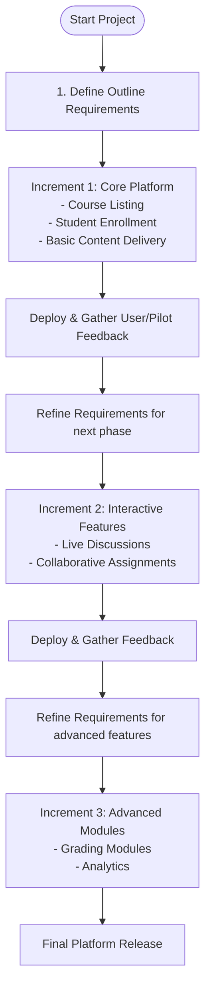
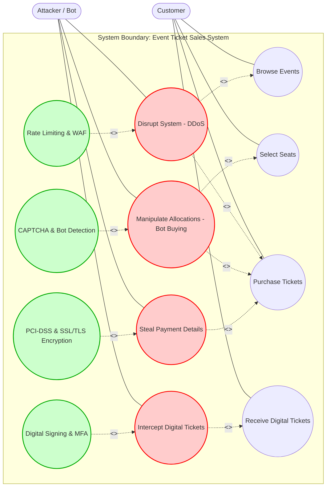
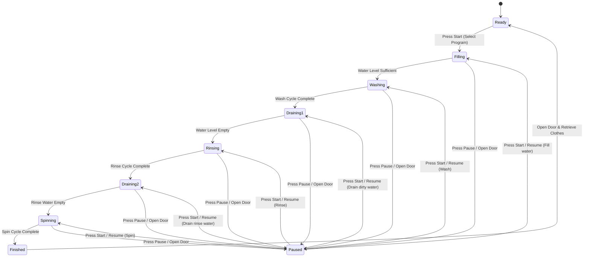
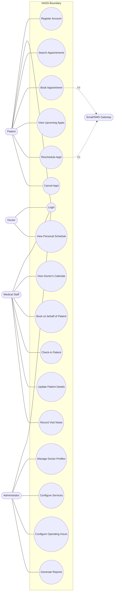
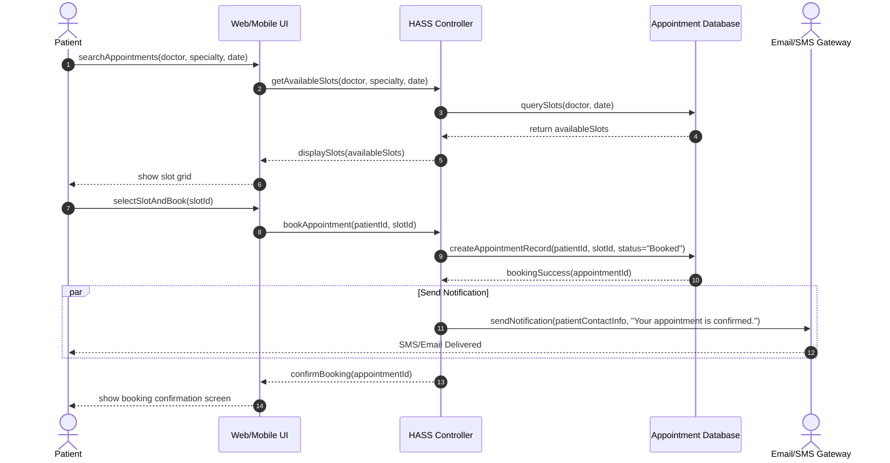
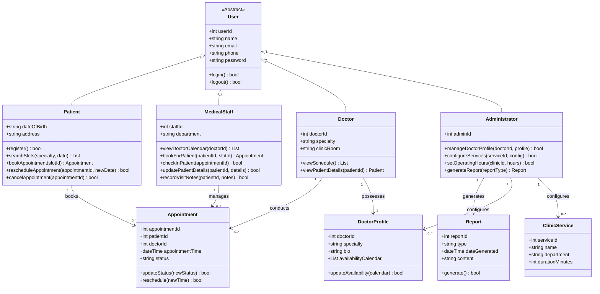

# CSE2001 - Software Engineering Final Exam Solutions
**Date of Exam:** 21/6/2025  
**Course Curriculum Reference:** [AllContent.txt](file:///d:/Gam3a/Exam-Creation/SoftwareEng/Lec/AllContent.txt)

---

## Part 1: Multiple Choice Questions (MCQs)

### Question 1:
How does the Spiral Model address requirement engineering throughout the software lifecycle?
- a) All requirements are fully defined and frozen at the very beginning of the project.
- **b) Requirements are incrementally refined and re-evaluated during each iteration.**
- c) Requirement engineering is primarily a post-development activity to document features.
- d) It focuses solely on technical requirements, ignoring user needs.

**Answer:** **b**  
**Explanation (Ref: [AllContent.txt:L304-307](file:///d:/Gam3a/Exam-Creation/SoftwareEng/Lec/AllContent.txt#L304-307)):** The Spiral Model is an iterative, risk-driven process model. Unlike the Waterfall model which freezes requirements early, each loop of the spiral involves identifying goals, analyzing risks, and incrementally refining and re-evaluating requirements based on prototype feedback.

---

### Question 2:
In the context of software testing, which technique focuses on testing the internal structure, design, and implementation of the software?
- **a) White-box Testing**
- b) Black-box Testing
- c) Acceptance Testing
- d) Regression Testing

**Answer:** **a**  
**Explanation (Ref: [AllContent.txt:L29-30](file:///d:/Gam3a/Exam-Creation/SoftwareEng/Lec/AllContent.txt#L29-30)):** White-box testing (also called structural testing) uses knowledge of the program's code, structure, design, and implementation to design test cases, contrasting with Black-box testing which relies solely on requirements.

---

### Question 3:
Which of the following best describes a 'hard real-time' system?
- a) A system where missing a deadline degrades performance but is tolerable.
- **b) A system where missing a deadline results in catastrophic system failure.**
- c) A system that responds quickly to user input, but not necessarily within strict time constraints.
- d) A system that requires frequent updates to its software.

**Answer:** **b**  
**Explanation (Ref: [AllContent.txt:L1049-1050](file:///d:/Gam3a/Exam-Creation/SoftwareEng/Lec/AllContent.txt#L1049-1050)):** By definition, in a hard real-time system, the correctness of the system depends not only on the logical result but also on the time it is delivered. Missing a timing deadline leads to total and potentially catastrophic failure of the system.

---

### Question 4:
Which of the following is a characteristic of the Incremental Model?
- a) All requirements are gathered and documented at the beginning.
- b) It is best suited for projects with well-understood and stable requirements.
- **c) A working version of the system is produced quickly and then evolved.**
- d) It minimizes customer feedback during development.

**Answer:** **c**  
**Explanation (Ref: [AllContent.txt:L104-108](file:///d:/Gam3a/Exam-Creation/SoftwareEng/Lec/AllContent.txt#L104-108)):** In the incremental model, development is broken down into multiple increments. The basic core requirements are implemented first, yielding a working version of the system quickly, which is subsequently evolved and expanded in later stages.

---

### Question 5:
Which type of stimulus in a real-time system occurs at unpredictable intervals?
- a) Periodic Stimuli
- b) Deterministic Stimuli
- c) Continuous Stimuli
- **d) Aperiodic Stimuli**

**Answer:** **d**  
**Explanation (Ref: [AllContent.txt:L1064-1066](file:///d:/Gam3a/Exam-Creation/SoftwareEng/Lec/AllContent.txt#L1064-1066)):** Aperiodic stimuli occur irregularly and unpredictably, usually triggered by external events in the environment (e.g., interrupts or emergency overrides), unlike periodic stimuli which occur at set intervals.

---

## Part 2: Scenario-Based Questions

### Scenario A: Autonomous Traffic Light Control System

#### a) Classification & Justification
- **Classification:** **Hard Real-time System**
- **Justification:** According to the scenario, *"A delay of even a few seconds in reaction time could lead to gridlock or serious accidents."* In a hard real-time system, missing a deadline results in catastrophic failure (collisions, safety hazard, loss of life). In contrast, soft real-time systems only experience degraded performance when deadlines are missed. Because this system is safety-critical and failure to respond in time leads to physical harm, it is a hard real-time system.

#### b) Stimuli Identification
- **Periodic Stimulus:** The regular polling of inductive loop sensors in the road (e.g., every 50ms) to read vehicle speeds and count presence, or continuous frame-by-frame feed analysis from the cameras.
- **Aperiodic Stimulus:** The sudden detection of an emergency vehicle siren, or an emergency manual override signal from traffic authority dispatchers, which happens at unpredictable intervals.

#### c) Responsiveness
- **Responsiveness** is the system's ability to receive an environmental input (stimulus) and complete the execution of the corresponding logic to control the output (actuator) within a strict, guaranteed timing deadline (Ref: [AllContent.txt:L1040-1043](file:///d:/Gam3a/Exam-Creation/SoftwareEng/Lec/AllContent.txt#L1040-1043)).
- In this specific traffic control system, responsiveness represents how quickly the system processes video streams showing an approaching car or an emergency siren, computes the updated timing schedule, and changes the traffic signals to prevent accidents.

---

### Scenario B: Online Course Platform

#### a) Recommended Model & Justification
- **Recommended Model:** **Incremental Development Model**
- **Justification:**
  1. **Quick Initial Feedback:** The scenario specifies that the university wants to *"prioritize quick initial deployment to gather user feedback"*. The Incremental model allows rapid release of a core version (with basic listing and enrollment) to gather feedback, which then informs subsequent builds.
  2. **Evolving & Flexible Scope:** The university anticipates adding complex, interactive features (live discussion, analytics) in *"future phases based on pilot program feedback and emerging technologies."* The Incremental model is designed to handle changing requirements, allowing specification, development, and validation to interleave (Ref: [AllContent.txt:L104-108](file:///d:/Gam3a/Exam-Creation/SoftwareEng/Lec/AllContent.txt#L104-108)).

#### b) Flow Diagram for the Incremental Process Model

#### c) Evaluation of the Alternative Model (Waterfall Model)
- **Why Waterfall is Less Appropriate:**
  1. **Inflexibility to Change:** Waterfall is a linear, sequential plan-driven model (Ref: [AllContent.txt:L130-133](file:///d:/Gam3a/Exam-Creation/SoftwareEng/Lec/AllContent.txt#L130-133)). All requirements must be finalized at the start. Since the university needs to adapt based on feedback and emerging educational technologies, any changes under Waterfall would require expensive rework.
  2. **No Early Working System:** Under Waterfall, the platform would not be delivered or seen by users until the very end of the cycle (after all coding and testing of all features is complete). This directly conflicts with the goal of a quick initial pilot deployment to gather feedback.

---

## Part 3: Behavioral & Security Modeling

### A. Misuse Case Diagram (Online Public Event Ticket Sales System)

This misuse case diagram shows how an Attacker (Misuser) threatens standard ticket operations and how the system uses security controls to mitigate these threats.

---

### B. State Machine Diagram (Automatic Washing Machine)

This state machine models the washing cycles, including the ability to transition to a `Paused` state at any point before completion, and resume where it left off.

---

## Part 4: Comprehensive UML System Specification (HASS)

### 1. Use Case Diagram
Shows the relationships between Patients, Medical Staff, Doctors, Administrators, and the HASS system.

---

### 2. Sequence Diagram (Patient Booking an Appointment)
Shows the sequential flow of messages during a successful appointment booking.

---

### 3. Class Diagram
Describes the object structure, attributes, methods, and relationships of the HASS classes.

