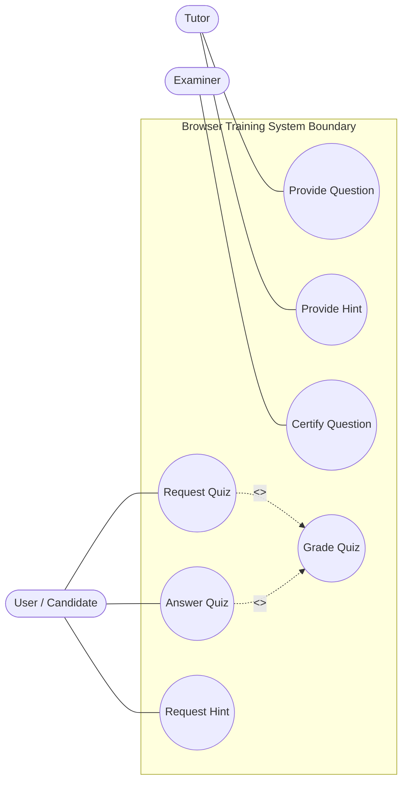
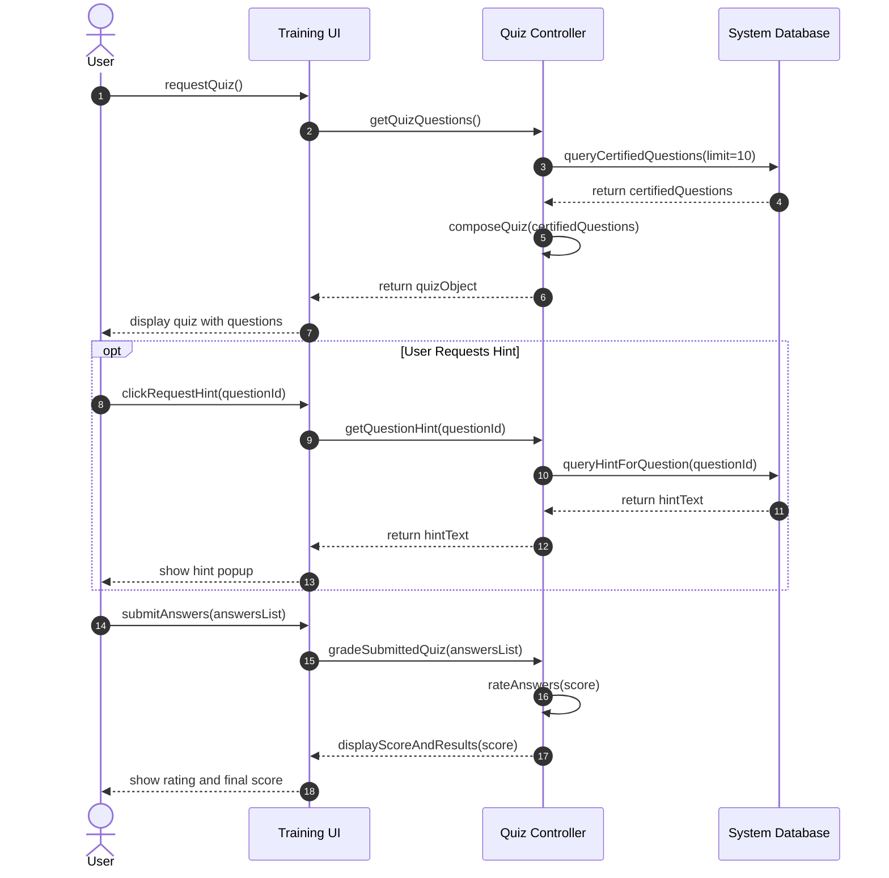

# CSE2001 - Software Engineering Final Exam Solutions
**Date of Exam:** 6/1/2026  
**Course Curriculum Reference:** [AllContent.txt](file:///d:/Gam3a/Exam-Creation/SoftwareEng/Lec/AllContent.txt)

---

## Question 1: True / False Statements with Reasons

### 1. Functional requirements that focuses on what the system should do and should not do.
- **Answer:** **True**  
- **Reason (Ref: [AllContent.txt:L446-451](file:///d:/Gam3a/Exam-Creation/SoftwareEng/Lec/AllContent.txt#L446-451)):** Functional requirements describe the system services or functions that the software must provide (what it should do), and also specify security restrictions or invalid operations that the system must prevent (what it should not do).

### 2. Component diagram depicts a static view of the run-time configuration of hardware nodes and the software components that run on those nodes.
- **Answer:** **False**  
- **Reason:** The description matches a UML **Deployment Diagram**. A UML Component Diagram shows the logical structure and dependencies of software components and their interfaces, representing a software architecture view rather than physical hardware configuration.

### 3. The formal project monitoring mechanisms rely on the ability of project manager to make daily discussions with project staff.
- **Answer:** **False**  
- **Reason:** Daily discussions with staff are an **informal** project monitoring mechanism. Formal mechanisms rely on structured reporting, deliverables status, tracking milestones, and scheduled progress review meetings.

### 4. The project delivers is part of project plan which represent the beginning and end date of the task or project.
- **Answer:** **False**  
- **Reason:** The beginning and end dates of a task are part of the **project schedule** (timeline). A **project deliverable** is a tangible output or artifact (such as a requirements specification document or a code module) produced at the end of a task or phase.

### 5. Failing to meet a non-functional requirement can mean that the whole system is unusable.
- **Answer:** **True**  
- **Reason (Ref: [AllContent.txt:L460-462](file:///d:/Gam3a/Exam-Creation/SoftwareEng/Lec/AllContent.txt#L460-462)):** Non-functional requirements constrain the system as a whole (such as security, safety, reliability, or response speed). If a critical constraint is violated, the system becomes unsafe or unusable, regardless of whether its individual functions work.

### 6. The standard requirement is classified as non-functional and organizational requirement.
- **Answer:** **True**  
- **Reason:** Conformance to development standards, programming language conventions, or legislative regulations is classified as an **organizational requirement** (or external requirement), which falls under the non-functional requirements domain.

### 7. Domain requirements that come from the application domain of the system and that reflect characteristics and constraints, and they are represented as non functional requirements.
- **Answer:** **False**  
- **Reason (Ref: [AllContent.txt:L457-458](file:///d:/Gam3a/Exam-Creation/SoftwareEng/Lec/AllContent.txt#L457-458)):** Domain requirements are not represented solely as non-functional. While they can constrain functions, they often introduce brand-new functional requirements in their own right (such as formulas for banking interest) or dictate how specific mathematical computations must be performed.

### 8. Use Case diagram represents the interaction of the user with the software but tells nothing about the internal working of the software.
- **Answer:** **True**  
- **Reason (Ref: [AllContent.txt:L18](file:///d:/Gam3a/Exam-Creation/SoftwareEng/Lec/AllContent.txt#L18)):** A Use Case diagram displays an external actor's interaction with system functions. It acts as a black-box model of features and does not depict any internal design, database structures, or execution workflow.

### 9. The object diagram is more specific compared to class diagram, where it shows instances instead of classes.
- **Answer:** **True**  
- **Reason (Ref: [AllContent.txt:L20-21](file:///d:/Gam3a/Exam-Creation/SoftwareEng/Lec/AllContent.txt#L20-21)):** While a class diagram shows the general structure and relationships of classes, an object diagram captures a concrete snapshot of actual objects, showing their runtime attributes and links at a specific moment.

### 10. When comparing the Communication Diagram and the Activity Diagram, we'll see the first is more focused on showing the collaboration of objects rather than the time sequence.
- **Answer:** **True**  
- **Reason:** A UML Communication Diagram models interactions by highlighting the structural layout and collaboration of objects that send messages, while an Activity Diagram models procedural workflows and control flow transitions (actions in sequence), behaving like a flowchart rather than object mapping.

---

## Question 2: Multiple Choice Questions (MCQs)

### 1. Which model can be selected if unexperienced user is involved in all the phases of SDLC?
- a) Waterfall Model
- **b) Prototyping Model**
- c) iterative Model
- d) both Prototyping Model & iterative Model

**Answer:** **b**  
**Explanation (Ref: [AllContent.txt:L230-231](file:///d:/Gam3a/Exam-Creation/SoftwareEng/Lec/AllContent.txt#L230-231)):** When users are inexperienced, they often struggle to express requirements. Prototyping builds a mock-up/working model that allows users to interact with the system, clarify their expectations, and establish solid requirements.

---

### 2. Which of the following considers as milestones:
- a. The project plan approval.
- b. The requirement definition
- c. The design identification
- **d. A and C**

**Answer:** **d**  
**Explanation:** A milestone is a discrete event marking the completion of a key deliverable or phase (e.g., plan approval or design identification). Requirement definition is an ongoing activity or task, not a point-in-time milestone.

---

### 3. The project scheduling processes are iterative process that may be repeated from the:
- a. Identifying activity stage
- b. Estimate process stage
- c. Identifying activity dependencies stage
- **d. All of the mentioned**

**Answer:** **d**  
**Explanation:** When project updates occur (e.g., task delays or resource conflicts), scheduling must be iteratively re-run. This may involve redefining tasks (activities), updating duration/effort estimates, or altering task dependencies.

---

### 4. Proposal Writing is one of the management activities which concerns on:
- a. keep track of the progress of the project
- b. identifying the activities, milestones and deliverables produced by a project
- **c. describes the objectives of the project, cost and schedule estimates**
- d. Motivating project personnel

**Answer:** **c**  
**Explanation (Ref: [AllContent.txt:L58-62](file:///d:/Gam3a/Exam-Creation/SoftwareEng/Lec/AllContent.txt#L58-62)):** Proposal writing is a pre-project activity that defines what the project will accomplish, outlines its objectives, and offers cost and schedule estimates to clients.

---

### 5. The system allow the registered user to check the history", which kind of requirements this sentence represents:
- a. non functional
- b. system
- **c. functional**
- d. non of mentioned

**Answer:** **c**  
**Explanation (Ref: [AllContent.txt:L446-451](file:///d:/Gam3a/Exam-Creation/SoftwareEng/Lec/AllContent.txt#L446-451)):** Checking user history is a concrete functional service/capability that the system must provide to the user, making it a functional requirement.

---

## Question 3: Essay Questions

### 1. Discuss the different risk planning strategies, illustrate your answer with example
Risk planning strategies are grouped into three categories based on how the project manager handles identified risks:
- **Avoidance Strategies:** These strategies aim to prevent the risk from arising in the first place by designing the process or product to eliminate the risk condition.
  - *Example:* To avoid the risk of key staff members leaving and stalling development, the manager can utilize standard programming environments and mandate continuous documentation so any new developer can quickly take over.
- **Minimization Strategies:** These strategies aim to reduce the impact of the risk if it does occur.
  - *Example:* If there is a risk of a third-party software component being delayed or containing bugs, the system can be designed with clear interfaces/wrappers so the component can be easily replaced by an alternative software module without affecting the whole system.
- **Contingency Plans:** These plans are action sheets prepared in advance to handle the risk if it actually occurs.
  - *Example:* If there is a risk of severe database server crash, the contingency plan would involve setting up automatic daily off-site backups and preparing a secondary hot-standby database server to switch over immediately.

---

### 2. List the project scheduling processes, then discuss them in detail
Project scheduling is an iterative process where tasks are planned over a project timeline:
1. **Identify Activities:** Break down the project into discrete, manageable tasks or work packages that need to be executed to produce deliverables.
2. **Identify Activity Dependencies:** Determine the chronological relationships between activities (e.g., Task B cannot start until Task A is completed).
3. **Estimate Resources for Activities:** Assess the resources (e.g., number of programmers, hardware systems, tools) required to complete each activity.
4. **Estimate Activity Durations / Allocate People:** Predict the amount of calendar time required to complete each task, and assign specific team members to them.
5. **Create Project Schedule:** Synthesize all the previous details into project charts (like Gantt charts or network diagrams) showing the timeline, start/end dates, milestones, and critical path.

---

### 3. Discuss the Objectives of Software Engineering
Software Engineering is an engineering discipline concerned with all aspects of software production from early specification to system maintenance. Its objectives are:
- **High Quality & Reliability:** Developing software that behaves correctly, meets specifications, resists security threats, and does not fail under expected workloads.
- **On Time & Within Budget:** Delivering the system within the scheduled deadlines and the financial constraints of the project.
- **Maintainability:** Writing software structure and code in a modular, well-documented way so that it can easily evolve to meet changing customer needs over time.
- **Efficiency:** Ensuring that the software does not waste system resources (such as memory, processor cycles, or energy).
- **Usability & Acceptability:** Developing user interfaces that are understandable and usable for the targeted user group, integrating well with their existing tools.

---

## Question 4: UML Modeling (Browser-Based Training System)

### A. Use Case Diagram
Models the interactions of Candidate (User), Tutor, and Examiner with the training system.

---

### B. Sequence Diagram (Taking a Quiz and Requesting Hints)
Shows the dynamic interactions of objects when a candidate requests, takes, and submits a quiz.

---

## Question 5: Risk Classification & Analysis

### 1. New Technologies used in the product; for example a new DB server, a new programming language.
- **Risk Type:** **Technology Risk**
- **Reason:** This risk stems directly from implementing software or hardware technologies that are new or unfamiliar to the development team, potentially leading to implementation bugs or performance issues.

### 2. Delays in the delivery of the automated tools for testing, and Lack of testing environments.
- **Risk Type:** **Tool Risk** and **Technology/Organizational Risk** (Overlapped)
- **Reason:** Delivery delays of automated tools constitute a **Tool Risk** (tools not performing or arriving as scheduled), while the absence of a proper testing environment is an **Organizational Risk** (failure to provision infrastructure/hardware resources).

### 3. New government regulations or policies.
- **Risk Type:** **Organizational Risk** / **External Risk**
- **Reason:** Legislative updates or governmental policy shifts are external forces that impose new constraints, potentially changing requirements and delaying project timelines.

### 4. The communication between the client and team is insufficient.
- **Risk Type:** **People Risk** and **Requirements Risk** (Overlapped)
- **Reason:** Insufficient communication is a **People Risk** (soft skills, collaboration issues), which inevitably overlaps with **Requirements Risk** because poor communication results in misunderstood user requirements and scope creep.

### 5. Improper resource allocation are associated with software development process.
- **Risk Type:** **Organizational Risk** / **Project Management Risk**
- **Reason:** Poor resource scheduling, staff allocation, or project planning errors are internal organizational issues that affect the project workflow.
